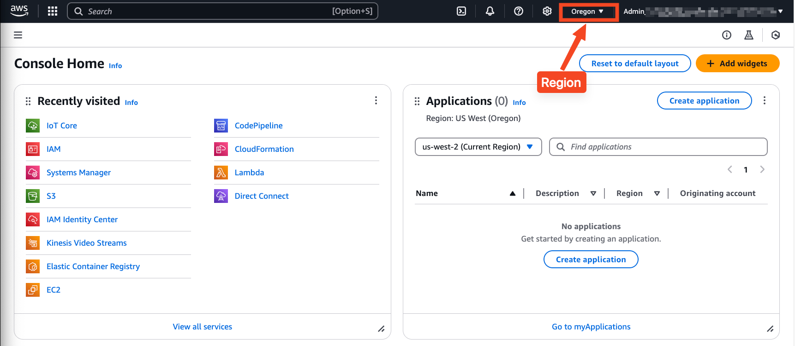
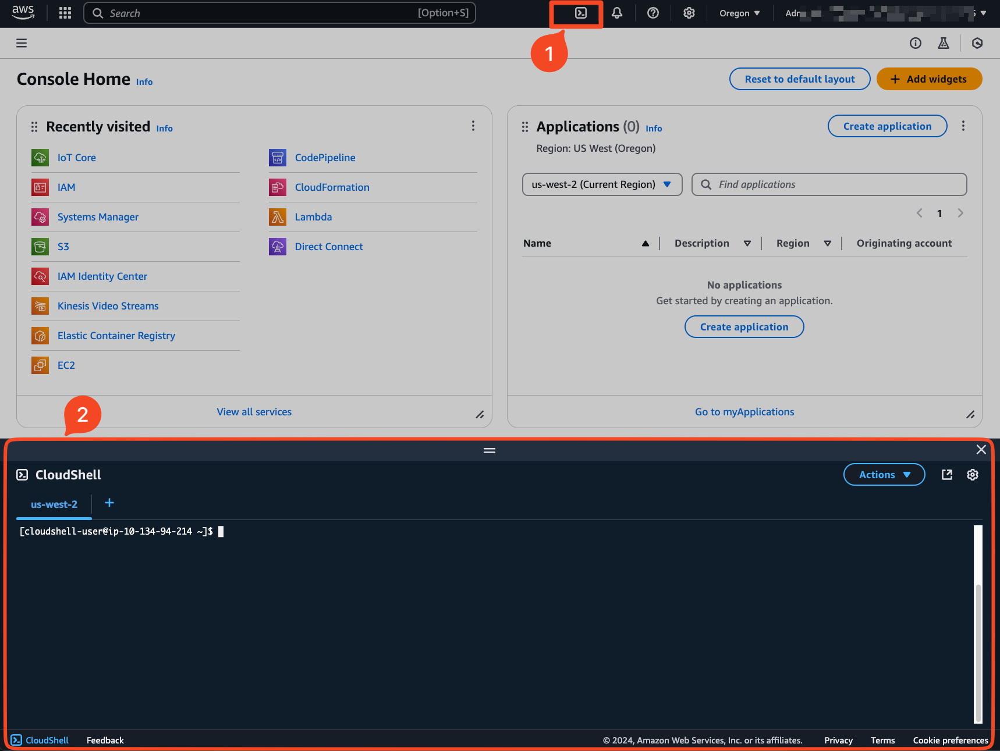

# AWS Greengrass Model Downloader

A robust solution for managing large file downloads from Amazon S3 to edge devices through AWS Greengrass. This solution can be used to deploy large machine learning models, such as Large Language Models (LLMs) and Vision Language Models (VLMs), on edge devices through AWS Greengrass.

## Overview

This component efficiently manages the downloading and handling of Large Language Model files from Amazon S3 to edge devices via AWS Greengrass. Built to overcome the 5GB Greengrass component artifact size limitation, it enables seamless model updates with minimal service interruption.

## Key Features

- Robust Download Management
  - Pause/Resume functionality
  - Progress tracking and real-time status updates via AWS IoT Core
  - Concurrent downloads using [s5cmd](https://github.com/peak/s5cmd)
  - Download listing and management
- Model Metadata Management
  - IoT Device Shadow integration for tracking model metadata
  - Automatic model registration upon successful download
  - Model versioning and update tracking
- Edge-Optimized Design
  - Modular architecture for edge computing environments
  - Efficient resource utilization
  - Minimal service interruption during model updates
- Integration & Control
  - Seamless AWS Greengrass ecosystem integration
  - Comprehensive command interface via MQTT
  - Real-time status updates and error reporting
  - Support for individual file and recursive directory downloads

## Why Use This Component?

- Overcomes Size Limitations: Bypasses the 5GB Greengrass component artifact size restriction
- Minimal Downtime: Downloads files without interrupting other services
- Real-time Monitoring: Provides continuous visibility into download progress
- Reliable Operations: Ensures robust handling of large file transfers in edge environments
- Command Control: Offers pause, resume, and cancel operations for active downloads
- Model Registry: Maintains a consistent record of all models stored on the device

## Alternative Implementation

A Java version with similar capabilities is available:
- [aws-greengrass-labs-s3-file-downloader](https://github.com/awslabs/aws-greengrass-labs-s3-file-downloader)

## Repository Structure
```
├── build_all.sh                            # Main build script for all components and Docker images
├── publish_all.sh                          # Main publish script with change detection
├── components/
│   └── aws.samples.S3Downloader/           # Main S3 downloader component
│       ├── main.py                         # Core download manager implementation
│       ├── src/
│       │   ├── utils/
│       │   │   └── logging_config.py       # Log config
│       │   ├── greengrass_mqtt.py          # Greengrass MQTT client implementation
│       │   ├── mock_mqtt.py                # Mock MQTT client for testing
│       │   ├── mqtt_interface.py           # MQTT interface definition
│       │   ├── model_shadow_manager.py     # Model metadata shadow management
│       │   ├── s3_command_service.py       # S3 command handling service
│       │   ├── s3_download_manager.py      # S3 download management
│       │   └── s5cmd_async.py              # Async s5cmd wrapper
│       ├── tests/
│       │   ├── test_s3_command_service.py  # Test s3_command_service.py using mock mqtt
│       │   └── test_s5cmd_async.py         # Test s5cmd_async.py
│       ├── recipe.yaml                     # Greengrass component recipe
│       └── requirements.txt                # Python dependencies
└── docker/                                 # Docker image build and publish scripts
```


## Usage Instructions

### Prerequisites

#### Edge Device Requirements:
- AWS Greengrass Core v2 installed
- Proper IAM role configuration for S3 access
- Linux-based operating system (for s5cmd compatibility)
- Sufficient disk space for downloads

#### Development Environment Requirements:
- Python 3.7 or later
- AWS CLI configured with appropriate permissions
- AWS IoT Greengrass Development Kit (GDK) installed
- AWS S3 bucket access permissions

#### Required Python packages:
- awsiotsdk >= 1.17.0
- awsiot >= 0.1.0

### Setting Up S3 Bucket Access for AWS Greengrass Role Alias

1. login to the AWS Console. Make sure that you are in the AWS region that you want to deploy your resources to.
   
2. Start CloudShell
   
3. Create the S3 Access Policy
   > ⚠️ **Warning**: The following policy grants access to all S3 buckets for demonstration purposes. In a production environment, you should restrict access to specific S3 bucket ARNs.
   Execute the following command in CloudShell:
   ```bash
    aws iam create-policy \
        --policy-name GreengrassComponentS3Access \
        --description "Allow Greengrass device to download model from S3" \
        --policy-document '{
            "Version": "2012-10-17",
            "Statement": [
                {
                    "Action": [
                        "s3:GetObject",
                        "s3:ListBucket"
                    ],
                    "Resource": [
                        "*"
                    ],
                    "Effect": "Allow"
                }
            ]
        }'
   ```
4. Attach Policy to Greengrass Role
   Run these commands to attach the newly created policy to the Greengrass token exchange role:
   ```bash
   ACCOUNT_ID=$(aws sts get-caller-identity --query Account --output text)
   aws iam attach-role-policy \
     --role-name GreengrassV2TokenExchangeRole \
     --policy-arn arn:aws:iam::${ACCOUNT_ID}:policy/GreengrassComponentS3Access
   ```
5. Verification
   ```bash
   aws iam list-attached-role-policies --role-name GreengrassV2TokenExchangeRole
   ```

### Build and Publish

> ℹ️ **Note**: Run below command in your local development envrionment

1. Clone the repository:
    ```bash
    git clone https://github.com/aws-samples/sample-model-downloader-greengrass-component.git
    cd sample-model-downloader-greengrass-component
    ```

2. Set up environment variables:
    ```bash
    python3 -m venv venv
    source ./venv/bin/activate 
    ```

3. Export AWS Temporary credentials:
    ```bash
    export AWS_ACCESS_KEY_ID=<YOUR_ACCESS_KEY_ID>
    export AWS_SECRET_ACCESS_KEY=<YOUR_SECRET_ACCESS_KEY>
    export AWS_SESSION_TOKEN=<YOUR_SESSION_TOKEN>
    export AWS_DEFAULT_REGION=<YOUR_AWS_REGION>
    ```

4. Verifiy AWS IoT Greengrass Development Kit (GDK) configuration
    Update region to your desired region.
    ```bash
    cat components/aws.samples.S3Downloader/gdk-config.json
    ```
    **Output**
    ```json
    {
      "component": {
        "aws.samples.S3Downloader": {
          "author": "Amazon Web Services",
          "version": "NEXT_PATCH",
          "build": {
            "build_system": "zip",
            "options": {
              "zip_name": "main-artifact"
            }
          },
          "publish": {
            "bucket": "greengrass-components",
            "region": "us-west-2"
          }
        }
      },
      "gdk_version": "1.3.0"
    }
    ```

5. Build the component:
    ```bash
    ./build_all.sh
    ```

6. Publish the component:
    ```bash
    ./publish_all.sh
    ```

### Deployment

1. Deploy the component to your Greengrass device through AWS IoT Console or AWS CLI:

    Make sure the change target-ar and componentVersion with yours.
    ```bash
    aws greengrassv2 create-deployment \
      --target-arn "arn:aws:iot:region:account:thing/thing-name" \
      --deployment-name "aws-greengrass-model-downloader" \
      --components '{"aws.samples.S3Downloader": {"componentVersion": "1.0.0"}}'
    ```

2. Monitor deployment status:
    ```bash
    aws greengrassv2 get-deployment --deployment-id "DEPLOYMENT_ID"
    ```

3. Send a download command through AWS IoT Core:

    **MQTT Topics**

    | Topic                             | Direction | Description                    |
    | --------------------------------- | --------- | ------------------------------ |
    | s3downloader/THING_NAME/commands  | Publish   | Send commands to the component |
    | s3downloader/THING_NAME/responses | Subscribe | Receive command responses      |
    | s3downloader/THING_NAME/status    | Subscribe | Receive status updates         |

    **Command Structure**

    | Name                     | Mandatory | Default | Description                                                                                               |
    | ------------------------ | --------- | ------- | --------------------------------------------------------------------------------------------------------- |
    | command                  | Y         |         | Command type (download, list, pause, resume, cancel)                                                      |
    | bucket                   | Y         |         | Specifies the source S3 bucket name                                                                       |
    | key                      | Y*        |         | S3 object key or prefix (required for download commands). Add trailing "/" for recursive folder downloads |
    | destination              | Y         |         | Local destination directory                                                                               |
    | numworkers               | N         | 256     | Size of global worker pool for parallel operations                                                        |
    | concurrency              | N         | 5       | Number of parallel transfers per file                                                                     |
    | retry_count              | N         | 10      | Number of retry attempts using exponential backoff (up to 1 minute) for transient errors                  |
    | s3_transfer_acceleration | N         | False   | Whether to use S3 transfer acceleration                                                                   |
    | download_id              | N         |         | Download ID (required for pause/resume/cancel commands)operation                                          |
    | model_meta               | N         |         | Model metadata for tracking (used with download or model_add commands)                                    |
    | model_id                 | N*        |         | Model identifier (required for model_get and model_delete commands)                                       |
    | command_id               | N         |         | Command identifier (auto-generated if not provided)                                                       |

    For detailed information about concurrency settings, please refer to the [s5cmd documentation on Configuring Concurrency](https://github.com/peak/s5cmd?tab=readme-ov-file#configuring-concurrency).

### Example Commands

1. Start a download with model metadata:
    ```json
    {
      "command": "download",
      "bucket": "my-data-bucket",
      "key": "vlm-7B/",
      "destination": "/tmp/downloads/model/vlm-7B",
      "model_meta": {
        "model_id": "vlm-7B",
        "model_name": "vlm-7B",
        "model_version": "2.5"
      }
    }
    ```

2. Pause an active download:
   Make sure the change "download-uuid" to your value.
    ```json
    {
      "command": "pause",
      "downloadId": "download-uuid"
    }
    ```

3. Resume a paused download:
   Make sure the change "download-uuid" to your value.
    ```json
    {
      "command": "resume",
      "downloadId": "download-uuid"
    }
    ```

4. Cancel a download:
   Make sure the change "download-uuid" to your value.
    ```json
    {
      "command": "cancel",
      "downloadId": "download-uuid"
    }
    ```

5. List all downloads:
    ```json
    {
      "command": "list"
    }
    ```

6. List all models in the shadow registry:
    ```json
    {
      "command": "model_list"
    }
    ```

7. Get details about a specific model:
    ```json
    {
      "command": "model_get",
      "model_id": "vlm-7B"
    }
    ```

8. Add or update model metadata directly:
    ```json
    {
      "command": "model_add",
      "model_meta": {
        "model_id": "vlm-7B",
        "model_name": "vlm-7B",
        "model_version": "2.5"
      }
    }
    ```

9. Delete a model from the registry:
    ```json
    {
      "command": "model_delete",
      "model_id": "vlm-7B"
    }
    ```

### Component Configuration

The component's behavior can be customized through the following configuration parameters in the recipe:

| Parameter       | Default                 | Description                                           |
| --------------- | ----------------------- | ----------------------------------------------------- |
| TopicPrefix     | "s3downloader"          | MQTT topic prefix                                     |
| DownloadDir     | "/data/downloads/model" | Default download directory                            |
| ProcessInterval | 10                      | Status update interval in seconds                     |
| LogLevel        | "INFO"                  | Logging level (DEBUG, INFO, WARNING, ERROR, CRITICAL) |
| S5cmdVersion    | "2.3.0"                 | Version of s5cmd to install                           |

## Architecture


The component consists of several key modules:

1. **S3CommandComponent (main.py)**: Main entry point that initializes the component and sets up MQTT communication.

2. **S3CommandService (s3_command_service.py)**: Core service that handles MQTT messages, executes commands, and publishes status updates.

3. **S3CommandManager (s3_download_manager.py)**: Manages download operations including tracking active downloads and their status.

4. **ModelShadowManager (model_shadow_manager.py)**: Manages model metadata using AWS IoT Device Shadows to provide a persistent registry of models on the device.

5. **AsyncS5CommandController (s5cmd_async.py)**: Wrapper for s5cmd that provides asynchronous execution and control capabilities.

6. **MQTT Interface (mqtt_interface.py)**: Abstract interface for MQTT communication with implementations for both Greengrass and mock testing.


## Model Shadow Management

The component uses AWS IoT Device Shadows to maintain a registry of all models on the device:

1. **Automatic Registration**: When a download with model metadata completes successfully, the model is automatically registered in the shadow.

2. **Manual Management**: Models can be added, updated, retrieved, or deleted using dedicated commands.

3. **Shadow Structure**: Models are stored in a named shadow called "models" with the following structure:
   ```json
   {
     "state": {
       "reported": {
         "models": {
           "model-id-1": {
             "model_id": "model-id-1",
             "local_path": "/path/to/model",
             "model_name": "Human readable name",
             "model_version": "1.0",
             "last_updated": 1682145600,
             "other_metadata": "value"
           },
           "model-id-2": {
             ...
           }
         }
       }
     }
   }
   ```

4. **Shadow Benefits**:
   - Persistent storage of model metadata across device restarts
   - Centralized model registry accessible by other components
   - Cloud-side visibility of models deployed to the device
   - Synchronization mechanism for model updates

## Operation Flow
1. Component receives commands via MQTT on the commands topic
2. Commands are processed and executed using s5cmd for S3 operations
3. Real-time status updates are published to the status topic
4. Command responses are sent to the response topic
5. Downloads can be paused, resumed, or cancelled at any time
6. Upon successful download completion:
   - If model metadata was provided, it is added to the device shadow
   - A model_added event is published to the response topic


## Optimization Tips

1. **Parallel Downloads with File Splitting**

   For very large files, consider splitting them into smaller chunks:
   - Use [amazon-s3-tar-tool](https://github.com/awslabs/amazon-s3-tar-tool) to split files directly in S3
   - Example:
     ```bash
     # Creates 1GB tarballs
     s3tar --region us-west-2 --size-limit 1074000000 -cvf s3://bucket/archive.tar s3://bucket/files/
     ```

2. **S3 Transfer Acceleration**

   Enable faster transfers by using S3 Transfer Acceleration:
   - Enable Transfer Acceleration in your S3 bucket settings
   - Set the `s3_transfer_acceleration` parameter to `true` in your download command

3. **Optimizing Concurrency Settings**

   Adjust these parameters based on your network and device capabilities:
   - `numworkers`: Number of worker threads (increase for many small files)
   - `concurrency`: Number of parts downloaded in parallel per file (increase for large files)

4. **Monitoring and Logging**

   Monitor component status:
   - Check logs at: `/greengrass/v2/logs/aws.samples.S3Downloader.log`
   - Subscribe to status topics for real-time updates
   - Forward status messages to CloudWatch for historical tracking


## Troubleshooting

Common issues and solutions:

1. **Component fails to start**
   - Check Greengrass logs: `/greengrass/v2/logs/aws.samples.S3Downloader.log`
   - Verify AWS credentials and permissions
   - Ensure Python dependencies are installed correctly

2. **Downloads fail or timeout**
   - Check S3 bucket permissions
   - Verify network connectivity
   - Increase concurrency settings for large files
   - Check available disk space

3. **IoT messages not received**
   - Verify IoT Core policy permissions
   - Check MQTT topic subscriptions
   - Ensure correct topic prefix configuration

4. **Model shadow operations failing**
   - Check IoT policy permissions for shadow operations
   - Verify shadow paths and names
   - Look for error details in logs

5. **s5cmd installation failures**
   - Check for architecture compatibility
   - Verify internet connectivity for downloading binaries
   - Check install_s5cmd.sh permissions

### Test without Deployment

1. Navigate to the component directory:
    ```bash
    components/aws.samples.S3Downloader
    ```
2. Create and activate a Python virtual environment:
    ```bash
    # Create virtual environment
    python3 -m venv .venv

    # Activate virtual environment
    source .venv/bin/activate

    # Install dependencies
    pip install -r requirements.txt
    ```
3. Start s3_command_service and test. This modules uses mock MQTT.
    ```bash
    cd tests
    python3 test_s3_command_service.py --device-id dev-04 --topic-prefix s3downloader --download-dir /tmp/downloads/model/vlm-7B
    ```
   1. Interactive CLI Commands
      
      Once the service is running, you can use these commands in the interactive CLI:
      - help - Display available commands
      - status - Show system status (active downloads and disk space)
      - download <bucket> <key> [dest] - Download an S3 object
      - download-model <bucket> <key> [dest] --model-meta <json> - Download a model with metadata
      - list downloads - Show active downloads
      - list s3 <bucket> [prefix] - List S3 objects
      - pause <download-id> - Pause a download
      - resume <download-id> - Resume a paused download
      - cancel <download-id> - Cancel a download
      - details <download-id> - Get detailed information about a download
      - model-list - List all models in the shadow
      - model-get <model-id> - Get details about a specific model
      - model-add <model-id> <local-path> [name] [version] - Add a model to the shadow
      - model-delete <model-id> - Delete a model from the shadow
      - disk-space - Check available disk space
      - exit or quit - Exit the program

    ```plain
    ❯ python3 test_s3_command_service.py --device-id dev-01 --topic-prefix s3downloader --download-dir /tmp/model/vlm-7B
    YYYY-MM-DD 11:28:52,476 - src.s3_command_service - INFO - Starting S3CommandService for device dev-01
    YYYY-MM-DD 11:28:52,476 - src.mock_mqtt - INFO - Mock MQTT: Connected
    YYYY-MM-DD 11:28:52,476 - src.mock_mqtt - INFO - Mock MQTT: Subscribed to s3downloader/dev-01/commands
    YYYY-MM-DD 11:28:52,476 - src.mock_mqtt - INFO - Mock MQTT: Publishing to s3downloader/dev-01/status: {"device_id": "dev-01", "timestamp": 1745778532.476911, "active_downloads": 0, "downloads": []}
    YYYY-MM-DD 11:28:52,476 - test_s3_command_service - INFO - Service started for device dev-01
    YYYY-MM-DD 11:28:52,476 - test_s3_command_service - INFO - Command topic: s3downloader/dev-01/commands
    YYYY-MM-DD 11:28:52,476 - test_s3_command_service - INFO - Response topic: s3downloader/dev-01/responses
    YYYY-MM-DD 11:28:52,476 - test_s3_command_service - INFO - Status topic: s3downloader/dev-01/status
    YYYY-MM-DD 11:28:52,477 - src.mock_mqtt - INFO - Mock MQTT: Publishing to s3downloader/dev-01/status: {"device_id": "dev-01", "timestamp": 1745778532.4770172, "active_downloads": 0, "downloads": []}
    YYYY-MM-DD 11:28:52,477 - test_s3_command_service - INFO - Response on s3downloader/dev-01/status: {"device_id": "dev-01", "timestamp": 1745778532.476911, "active_downloads": 0, "downloads": []}
    YYYY-MM-DD 11:28:52,477 - test_s3_command_service - INFO - Response on s3downloader/dev-01/status: {"device_id": "dev-01", "timestamp": 1745778532.4770172, "active_downloads": 0, "downloads": []}

    S3 Command Service CLI
    ====================
    Type 'help' for available commands

    command> help

    Available Commands:
      help                             - Show this help message
      status                           - Show system status (active downloads and disk space)
      download <bucket> <key> [dest]   - Download an S3 object
      download-model <bucket> <key> [dest] --model-meta <json> - Download a model with metadata
        Example: download-model my-bucket model.bin ./models --model-meta {"model_id":"Qwen2.5-VL-7B"}
      list downloads                   - List active downloads
      list s3 <bucket> [prefix]        - List S3 objects
      list models                      - List all tracked models
      get-model <model-id>             - Get details about a specific model
      add-model <model-id> <local-path> - Add a model directly (without downloading)
      delete-model <model-id>          - Delete a model from tracking
      pause <download-id>               - Pause a download
      resume <download-id>              - Resume a paused download
      cancel <download-id>              - Cancel a download
      details <download-id>             - Get detailed information about a download
      disk-space                       - Check available disk space
      exit/quit                        - Exit the program

    command> list downloads
    YYYY-MM-DD 11:30:31,720 - src.mock_mqtt - INFO - Injecting message to s3downloader/dev-01/commands: {"command": "list", "listType": "downloads", "commandId": "cli-20250427215631"}
    YYYY-MM-DD 11:30:31,720 - src.s3_command_service - INFO - Received command: {"command": "list", "listType": "downloads", "commandId": "cli-20250427215631"}
    YYYY-MM-DD 11:30:31,720 - src.s3_command_manager - INFO - Executing command: {"command": "list", "listType": "downloads", "commandId": "cli-20250427215631"}
    YYYY-MM-DD 11:30:31,720 - src.mock_mqtt - INFO - Mock MQTT: Publishing to s3downloader/dev-01/responses: {"success": true, "downloads": [], "commandId": "cli-20250427215631"}
    YYYY-MM-DD 11:30:31,720 - src.mock_mqtt - INFO - Callback executed successfully
    List command sent: {
      "command": "list",
      "listType": "downloads",
      "commandId": "cli-20250427215631"
    }
    YYYY-MM-DD 11:30:31,720 - __main__ - INFO - Response on s3downloader/dev-01/responses: {"success": true, "downloads": [], "commandId": "cli-20250427215631"}

    command> download my-data-bucket vlm-7B/ /tmp/model/vlm-7B
    YYYY-MM-DD 11:31:02,810 - src.mock_mqtt - INFO - Injecting message to s3downloader/dev-01/commands: {"command": "download", "bucket": "my-data-bucket", "key": "vlm-7B/", "destination": "/tmp/model/vlm-7B", "commandId": "cli-20250427113102"}
    YYYY-MM-DD 11:31:02,811 - src.s3_command_service - INFO - Received command: {"command": "download", "bucket": "my-data-bucket", "key": "vlm-7B/", "destination": "/tmp/model/vlm-7B", "commandId": "cli-20250427113102"}
    YYYY-MM-DD 11:31:02,811 - src.s3_command_manager - INFO - Executing command: {"command": "download", "bucket": "my-data-bucket", "key": "vlm-7B/", "destination": "/tmp/model/vlm-7B", "commandId": "cli-20250427113102"}
    YYYY-MM-DD 11:31:02,811 - src.s3_command_manager - INFO - Download command received: {"command": "download", "bucket": "my-data-bucket", "key": "vlm-7B/", "destination": "/tmp/model/vlm-7B", "commandId": "cli-20250427113102"}
    YYYY-MM-DD 11:31:02,811 - src.s3_command_manager - INFO - Command ID received: cli-20250427113102
    YYYY-MM-DD 11:31:02,812 - src.s3_command_manager - INFO - Created download info with command_id: cli-20250427113102
    YYYY-MM-DD 11:31:02,812 - src.s3_command_manager - INFO - Download info keys: ['id', 'bucket', 'key', 'destination', 'start_time', 'status', 'progress', 'controller', 's5cmd_args', 'global_options', 'file_name', 'task', 'command_id']
    YYYY-MM-DD 11:31:02,813 - src.mock_mqtt - INFO - Mock MQTT: Publishing to s3downloader/dev-01/responses: {"success": true, "downloadId": "ebdf600a-59e2-47fe-850b-5b0086075801", "message": "Download started with ID: ebdf600a-59e2-47fe-850b-5b0086075801", "status": "downloading", "commandId": "cli-20250427113102"}
    YYYY-MM-DD 11:31:02,813 - src.mock_mqtt - INFO - Callback executed successfully
    Download command sent: {
      "command": "download",
      "bucket": "my-data-bucket",
      "key": "vlm-7B/",
      "destination": "/tmp/model/vlm-7B",
      "commandId": "cli-20250427113102"
    }
    YYYY-MM-DD 11:31:02,813 - src.s3_command_manager - INFO - Starting download ebdf600a-59e2-47fe-850b-5b0086075801: s5cmd --numworkers 256 --retry-count 10 cp --concurrency 5 --show-progress s3://my-data-bucket/vlm-7B/* /tmp/model/vlm-7B
    YYYY-MM-DD 11:31:02,818 - test_s3_command_service - INFO - Response on s3downloader/dev-01/responses: {"success": true, "downloadId": "ebdf600a-59e2-47fe-850b-5b0086075801", "message": "Download started with ID: ebdf600a-59e2-47fe-850b-5b0086075801", "status": "downloading", "commandId": "cli-20250427113102"}
    command> YYYY-MM-DD 11:31:02,871 - src.s5cmd_async - INFO - s5cmd version: b'v2.3.0-991c9fb'
    YYYY-MM-DD 11:31:02,872 - src.s5cmd_async - INFO - Executing command: s5cmd --numworkers 256 --retry-count 10 cp --concurrency 5 --show-progress s3://my-data-bucket/vlm-7B/* /tmp/model/vlm-7B
    YYYY-MM-DD 11:31:03,485 - src.s3_command_manager - INFO - Download ebdf600a-59e2-47fe-850b-5b0086075801 progress: 0.02%
    YYYY-MM-DD 11:31:03,685 - src.s3_command_manager - INFO - Download ebdf600a-59e2-47fe-850b-5b0086075801 progress: 0.07%
    YYYY-MM-DD 11:31:03,885 - src.s3_command_manager - INFO - Download ebdf600a-59e2-47fe-850b-5b0086075801 progress: 0.12%

    command> exit
    ```